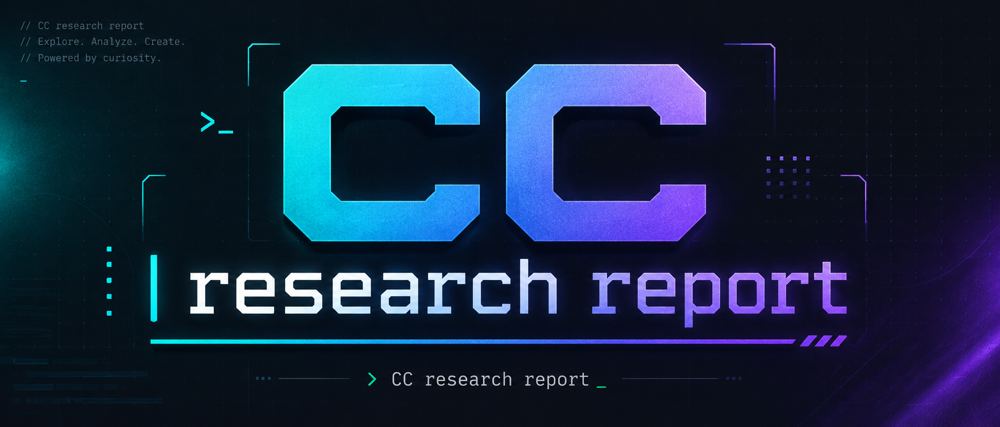

### Experimental: multi-turn adversarial research for Claude Code

[](LICENSE) [](https://github.com/npxcnency-ux/CC-Reseach-Report)

---

**cc-research-report brings structural adversarial validation to Claude Code research.**
Before searching, the worker commits to a Self Coverage Plan — 5–8 sub-questions each requiring a concrete verifier (a number, a named entity, a required comparison, a failure case, or a time anchor) — so coverage goals are locked before any evidence is gathered. A 4-track search strategy then drives the draft: mainstream consensus, counterarguments, failure cases, and unconventional angles, explicitly resisting confirmation bias. Four critics audit in parallel across independent axes — coverage integrity, reasoning quality, depth gaps, search-width — running as separate subagents with no shared context window, so they can't be anchored by the worker's narrative framing.

The worker holds rebuttal rights. It takes explicit `ACCEPT` / `CHALLENGE` / `PARTIAL` stances on every critic issue; critics must steelman each challenge before overruling. The Coverage Matrix — the research contract locked in Turn 1 — is patchable but never regenerable, preventing goalpost movement. The orchestrator filters cross-turn URL state to Critic-verified entries only, blocking unverified worker-claimed sources from being treated as confirmed in subsequent turns. Severity history, redo invariants, and research directions are all orchestrator-managed — no agent can launder state into the record. Every output claim carries an epistemic label: `[FACT·verified]` / `[INFERENCE]` / `[Domain Consensus]`.

| Naive multi-agent approach | cc-research-report |
|---|---|
| Search first, rationalize coverage later | Coverage Plan locked before first search |
| Single agent, single pass | Worker↔4 critics, up to 10 turns |
| Context shared between agents | Separate subagents — critics can't be anchored by worker's narrative |
| Critic verdict is final | Worker holds rebuttal rights: ACCEPT / CHALLENGE / PARTIAL |
| Coverage goals can shift mid-research | Coverage Matrix locked at Turn 1 — patchable, never regenerable |
| State self-reported by agents | Orchestrator manages URL provenance, redo invariants, severity history |

> 中文文档见 [README.zh.md](./README.zh.md)

---

## Install

```bash
git clone https://github.com/npxcnency-ux/CC-Reseach-Report.git
cd CC-Reseach-Report
./install-local.sh     # symlinks skills/ and agents/ into ~/.claude/
# Restart Claude Code to load.
./uninstall-local.sh   # to remove
```

**Requires:** [`frontend-design` plugin](https://github.com/anthropics/claude-plugins-official) — the HTML rendering step calls it on every run:

```
/plugin marketplace add anthropics/claude-plugins-official
/plugin install frontend-design
```

---

## Usage

Invoke from any Claude Code session:

```
/research-report impact of AI on education
/research-report "key risks of agentic AI systems"
/research-report competitive landscape of vector databases max_turns: 6
```

**Outputs:**

| File | Description |
|------|-------------|
| `./{title}-report.html` | Design-driven HTML report in current directory |
| `~/.claude/cache/research-loop/{slug}-{timestamp}.md` | Verified markdown + loop summary (audit trail) |
| `~/.claude/cache/research-loop/{slug}-{timestamp}-query.md` | Original question |

**Re-render without re-researching** — point `research-html-formatter` at the cached `.md` directly. Research is paid once; visual redesigns are free.

**Cache behavior** — if you ask a similar question within 7 days, the skill offers to reuse cached research and skip straight to HTML rendering.

---

## The pipeline

```
/research-report "your question"
        ↓
[Step 0] Cache check — reuse if ≤7 days old
        ↓
[Step 1] research-loop (up to 10 turns)
  ┌─ Worker: plan → search → draft → self-audit
  │    Turn 1: commits to Self Coverage Plan (5–8 sub-questions) before searching
  │    Turn 2+: rebuts every critic issue (ACCEPT / CHALLENGE / PARTIAL)
  │
  └─ 4 Critics in parallel (every turn):
       instruction  →  coverage matrix + URL verification + VERDICT
       dialectic    →  reasoning audit (specificity, bias, inference chain, consistency)
       depth        →  depth gaps + new research directions
       width        →  search log audit (uncovered tracks)
        ↓
  Repeat until VERDICT: PASS or max_turns reached
        ↓
[Step 1.5] Verified markdown written to ~/.claude/cache/research-loop/
        ↓
[Step 2] research-html-formatter → calls frontend-design skill → HTML on disk
        ↓
[Step 2.5] Design enforcement gate (rejects generic outputs)
```

### The two load-bearing principles

1. **Adversarial validation, not self-review.** The worker never critiques its own work. Four critics each own a narrow audit axis — coverage, reasoning, depth, search-width. No single agent tries to do everything.

2. **Mechanical gates over prompt instructions.** LLMs reliably skip structural requirements when asked nicely. Every critical invariant — Self Coverage Plan heading, Rebuttal stances, source URL format — has an orchestrator-level gate that forces a redo on failure. The [CHANGELOG](CHANGELOG.md) documents 20+ patches all following the same pattern: *prompt failed → add a gate*.

### Critic roster

| Agent | Model | Role |
|-------|-------|------|
| `research-worker` | Sonnet | Drafts, searches, self-audits, rebuts critic issues |
| `research-critic-instruction` | Opus | Coverage Matrix, URL verification (WebFetch + Playwright), Worker Rebuttal Adjudication. **Issues the VERDICT.** |
| `research-critic-dialectic` | Opus | Reasoning Audit: specificity, survivorship bias, inference chain, internal consistency |
| `research-critic-depth` | Opus | Depth gap analysis, generates new Research Directions each turn |
| `research-critic-width` | Opus | Search Log audit — flags topical tracks the worker planned but didn't execute |
| `research-html-formatter` | Opus | Renders verified markdown to design-driven HTML |

To change the model for any agent, edit the `model:` line in its frontmatter (`agents/*.md`) and restart Claude Code:

```yaml
---
name: research-worker
model: sonnet   # change to: opus / haiku / sonnet
---
```

Worker defaults to **Sonnet** (better URL fetch discipline, ~half the cost of Opus). Critics default to **Opus** (richer adversarial reasoning). Switching critics to Sonnet reduces cost but may weaken coverage matrix depth and reasoning audit quality.

---

## What's structurally enforced

- **Self Coverage Plan first** — worker commits to 5–8 verifiable sub-questions *before* running a single search; orchestrator gate rejects output that skips this
- **Source URL blacklist** — Evidence Table rows labeled `[FACT]` must have fetchable `https://` URLs; bare domains, grounding redirects, and SERP URLs are gate-rejected
- **Rebuttal stances** — worker must take explicit `ACCEPT / CHALLENGE / PARTIAL` position on every critic issue; silent compliance is rejected
- **Track B engagement** — worker must engage ≥ 2 Research Directions per turn
- **Design enforcement** — HTML formatter must declare a named aesthetic direction; generic `system-ui` outputs are rejected

---

## When to use this

**Good fit:**
- Multi-angle research where you need to trust the output — competitor analysis, policy comparison, literature overview
- Questions with contested evidence where naive synthesis misleads
- Research you'll share or publish — evidence table and claim labels provide a traceable audit trail
- Topics you may want to re-render with a different visual presentation later

**Not a good fit:**
- Quick lookups or single-fact questions
- Proprietary or internal data not accessible via web search
- Real-time data (prices, metrics, live feeds)
- Tasks requiring iterative back-and-forth with the user mid-research

---

## What it doesn't do

- It can't access proprietary, paywalled, or internal knowledge bases
- It doesn't retrieve real-time data — published content only
- English-language sources structurally dominate web search; non-English research topics may show shallower coverage of local literature
- The 4-track search strategy (mainstream / counterargument / failure / unconventional) systematically underexecutes tracks 3–4 in practice; depth critic flags gaps but the skew is structural
- No cross-session memory — each `/research-report` invocation is independent
- Turn 1 Self Coverage Plan redo is near-universal regardless of model — budget an extra sub-turn; this is a known structural limitation

---

## Requirements

- [Claude Code](https://claude.com/claude-code)
- [`frontend-design` plugin](https://github.com/anthropics/claude-plugins-official)
- Internet access for web search

---

## File structure

```
cc-research-report/
├── assets/
│   └── banner.png
├── skills/
│   ├── research-report/
│   │   └── SKILL.md              # pipeline orchestrator (Step 0→1→2)
│   └── research-loop/
│       └── SKILL.md              # worker↔critic loop, all mechanical gates
├── agents/
│   ├── research-worker.md
│   ├── research-critic-instruction.md
│   ├── research-critic-dialectic.md
│   ├── research-critic-depth.md
│   ├── research-critic-width.md
│   └── research-html-formatter.md
├── CHANGELOG.md                  # every patch + design decision rationale
├── install-local.sh
├── uninstall-local.sh
└── README.md
```

---

## License

[MIT](LICENSE)

---

[](https://star-history.com/#npxcnency-ux/CC-Reseach-Report&Date)
